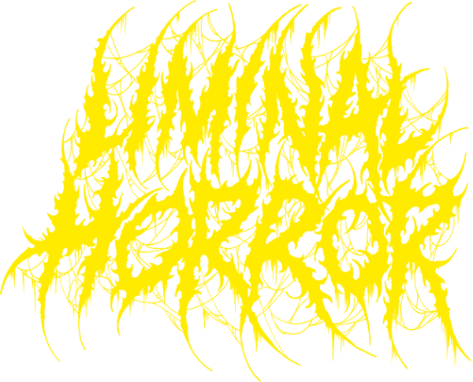
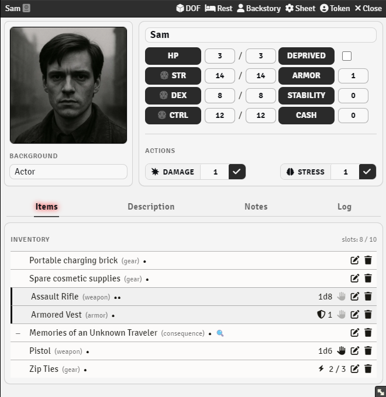

<div align="center">
  

# Liminal Horror — Foundry VTT System


[](https://github.com/666f78/liminal-horror/blob/master/CHANGELOG.md)

</div>

This is an **unofficial system** for [Foundry Virtual Tabletop](https://foundryvtt.com), designed to run games of **[Liminal Horror](https://liminalhorrorrpg.com)**.
It provides investigator sheets, rolling mechanics, and tools adapted to the rules of the game.

> ⚠️ **Disclaimer**: Unofficial system by D.H. / 666f78.
> Not affiliated with Goblin Archives, Josh Domanski, or Zach Hazard Vaupen.

## Features & Roadmap

- [x] Investigator sheet with core attributes, inventory, stress, and conditions.
- [x] Limited Investigator sheet.
- [x] Support for dice rolls and saving throws according to the Liminal Horror rules.
- [x] Simple inventory and slot-based encumbrance.
- [x] GM tools for stress, injuries, and custom rolls.
- [x] GM `Log` tab in actor sheet and background generator button.
- [x] Localization support (English, Українська).
- [ ] Appendix L: Luck (⚠️ beta: toggle in Settings if you want to try)
- [ ] Update UI (💬 possibly: may be implemented after feedback)
- [ ] Compendium (⚠️ WIP: currently spawns items in the Items tab, language-dependent)
- [ ] Appendix C: Conditions
- [ ] Appendix I: Item Tags
- [ ] Appendix T: Time Procedures

## Installation

1. Open **Foundry VTT**.
2. Navigate to **Game Systems → Install System**.
3. Paste the system manifest URL below:

```bash
https://github.com/666f78/liminal-horror/releases/latest/download/system.json
```

4. Click **Install**.
5. After installation, create a new world using **Liminal Horror** system.

> 💡 **Tip**: You can also install manually by downloading this repository as a ZIP and placing it in your Foundry `Data/systems` folder.

## Usage

- Create a new Actor → Choose **Investigator** to make a player sheet.
- Add attributes, inventory items, and conditions directly from the sheet.
- Roll attributes and saves with integrated buttons.
- GMs can apply stress, conditions, and whisper rolls privately.



## Contributing

Feedback and pull requests are welcome. Please use GitHub Issues for bug reports or feature requests.
For localization contributions, please submit `.json` files via PR.

## License

This work is based on **Liminal Horror**, developed by Goblin Archives, Josh Domanski, and Zach Hazard Vaupen, and published under the [Creative Commons Attribution-ShareAlike 4.0 International License (CC BY-SA 4.0)](https://creativecommons.org/licenses/by-sa/4.0/).

The **Foundry VTT system adaptation** has been developed by **D.H. / 666f78** and is likewise released under the **CC BY-SA 4.0 License**.
You are free to share and adapt this system, provided that you give appropriate credit to both the original creators of _Liminal Horror_ and to the author of this adaptation, and distribute your contributions under the same license.

Liminal Horror © Goblin Archives, Josh Domanski, and Zach Hazard Vaupen.
Foundry VTT system adaptation © D.H. / 666f78.
This project is not affiliated with, endorsed, or sponsored by Goblin Archives, Josh Domanski, or Zach Hazard Vaupen.

## Credits

- **Liminal Horror** created by Goblin Archives, Josh Domanski, and Zach Hazard Vaupen.
  Licensed under [CC BY-SA 4.0](https://creativecommons.org/licenses/by-sa/4.0/).
- **Foundry VTT system adaptation** by **D.H. / 666f78**, licensed under [CC BY-SA 4.0](https://creativecommons.org/licenses/by-sa/4.0/).

## Changelog

See the [CHANGELOG.md](https://github.com/666f78/liminal-horror/blob/master/CHANGELOG.md) for details.
